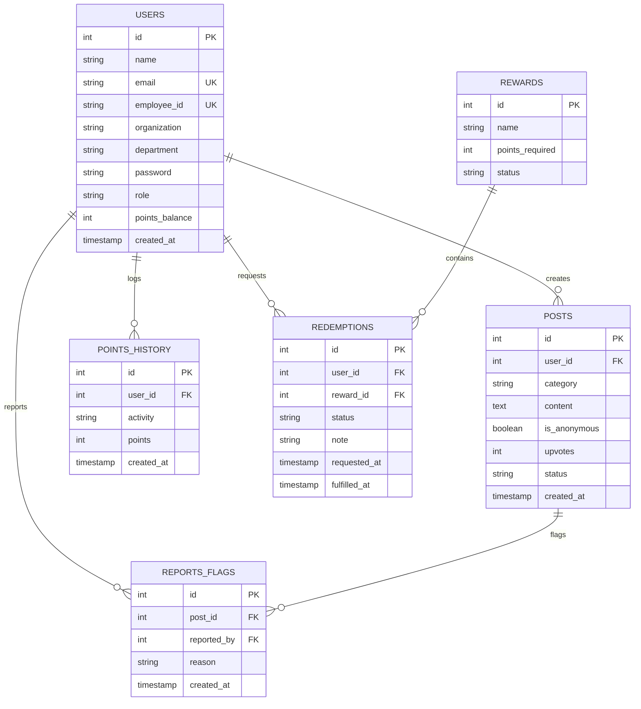

# 🏢 EmployeePlus — Anonymous Feedback & Rewards Portal

> **Prepared for:** GWS Digital Services (Internship Project)  
> **Author:** Full Stack Engineering Intern  
> **Status:** Completed (Day 1 – Day 6 All Modules & Acceptance Criteria)

[](https://react.dev/)
[](https://expressjs.com/)
[](https://www.postgresql.org/)
[](https://nodejs.org/)
[](https://jwt.io/)

---

## 📌 Executive Summary

Honest workplace feedback often goes unheard because employees fear being identified. Complaints, confessions, and constructive suggestions never reach HR in an organized manner.

**EmployeePlus** solves this by providing a centralized web portal where employees across all company services can post anonymous feedback, rate their weekly experience, and earn points redeemable for real rewards—all moderated end-to-end by HR/Admin while maintaining **strict, unbreakable anonymity on the feed**.

---

## 🛡️ The Mandatory Requirement: Strict Anonymity Guard

> **Zero Exposure Rule:** The author of a post is **NEVER** exposed on the frontend feed or in public API payloads under any circumstance.  
> The link between a post and its `user_id` exists **only in the backend database**, purely for points distribution and moderation integrity.

---

## ✨ Core Modules & Functional Requirements

### 1. 🔐 Module 1: Auth & Anonymous Feed
- **Unified Authentication**: Single login portal for both Employees and Admins. Role auto-assigns to `employee`.
- **4 Feedback Categories**:
  - `Complaint` (+5 pts)
  - `Confession` (+5 pts)
  - `Suggestion` (+8 pts)
  - `Appreciation` (+5 pts)
- **Feed Capabilities**: Shared company-wide feed, Category filter pills, Sort by **Newest First** or **Most Upvoted**.
- **Weekly Pulse Rating**: Anonymous 1–5 star rating widget ("How was your week?") with auto-crediting **+2 points**.
- **🚩 Post Reporting**: Employee-facing "Report" button with reason modal for discreet HR moderation.

### 2. 🪙 Module 2: Points Engine & Transparent Ledger
- **Automatic Points Crediting Matrix**:
  | Activity / Event | Points Awarded |
  | :--- | :---: |
  | Suggestion Post | **+8 pts** |
  | Complaint / Confession / Appreciation Post | **+5 pts** |
  | Weekly Office Pulse Rating | **+2 pts** |
  | Post reaches 15+ Upvotes | **+15 pts** (Bonus to author) |
  | Daily Login | **+1 pt** (Once per calendar day) |

- **Points Ledger (`/points-history`)**: Complete transparent transaction log of Date, Activity, Points (+ / -), and Running Balance.
- **Reliability Invariant**: Guaranteed `users.points_balance == sum(points_history.points)`.

### 3. 🎁 Module 3: Rewards & Redemption Portal
- **Rewards Catalog (`/rewards`)**:
  | Reward Perk | Points Required |
  | :--- | :---: |
  | ☕ Lunch / Coffee Voucher | **100 pts** |
  | 🏖️ Extra Day Off | **150 pts** |
  | 💵 Rs. 1000 Cash Reward | **200 pts** |
  | 🎓 Free Course Enrollment | **300 pts** |
  | 🎨 Free Logo / Design Service | **500 pts** |

- **Redemption Workflow**:
  - Balance validation (`balance >= required`).
  - Instant deduction and negative transaction logging in `points_history`.
  - Live status tracking: `Pending` ➔ `Approved` ➔ `Fulfilled` / `Rejected`.
  - **Automated Refund**: If HR rejects a redemption request, points are instantly refunded to the employee's balance.

### 4. 🛡️ Module 4: Moderation & Admin Dashboard (`/admin`)
- **5 High-Level Metric Cards**:
  1. 👥 Total Employees
  2. 📝 Total Posts (This Month)
  3. 🎁 Pending Redemptions
  4. 🚩 Flagged Posts
  5. 🪙 Points Distributed (This Month)
- **Redemptions Queue**: Filter requests by status; **Approve**, **Fulfill** (with timestamp), or **Reject** (with reason note & auto-refund).
- **Moderation Queue**: Review reported posts, reasons, and report counts. One-click **Hide from Feed**, **Remove Post**, or **Dismiss Flags**.
- **Rewards Catalog Management**: Create new custom reward perks or toggle active/inactive status.

---

## 🗄️ Database Architecture



---

## 🚀 Installation & Setup Guide

### 1. Prerequisites
- **Node.js** (v18 or higher)
- **PostgreSQL** (v14 or higher) running locally on port `5432`

---

### 2. Backend Setup
1. Navigate to the `backend` directory:
   ```bash
   cd backend
   ```
2. Install dependencies:
   ```bash
   npm install
   ```
3. Configure your `.env` file (refer to `.env.example`):
   ```env
   PORT=5050
   DB_USER=postgres
   DB_PASSWORD=your_postgres_password
   DB_HOST=localhost
   DB_PORT=5432
   DB_NAME=employeeplus
   JWT_SECRET=your_jwt_secret_key
   ```
4. Create the PostgreSQL database:
   ```sql
   CREATE DATABASE employeeplus;
   ```
5. Seed database tables and sample data:
   ```bash
   npm run seed
   ```
6. Start the backend server:
   ```bash
   npm start
   # Server runs on http://localhost:5050
   ```

---

### 3. Frontend Setup
1. Open a new terminal and navigate to the `frontend` directory:
   ```bash
   cd frontend
   ```
2. Install dependencies:
   ```bash
   npm install
   ```
3. Start the React development server:
   ```bash
   npm start
   # Opens automatically on http://localhost:3000
   ```

---

## 🔑 Pre-seeded Demo Credentials

| Role | Name | Email | Password | Initial Balance |
| :--- | :--- | :--- | :--- | :---: |
| **Admin / HR** | Admin HR | `admin@gws.com` | `Admin@123` | — |
| **Employee** | Ayesha Khan | `ayesha@gws.com` | `Password@123` | **185 pts** |
| **Employee** | Sara Ahmed | `sara@gws.com` | `Password@123` | **240 pts** |
| **Employee** | Hamza Ali | `hamza@gws.com` | `Password@123` | **60 pts** |
| **Employee** | Zainab Tariq | `zainab@gws.com` | `Password@123` | **12 pts** |

*(You can also use the **Quick Demo Login** buttons on the login screen or register a new employee via **Sign Up**)*

---

## 🧪 Automated Testing

To run the automated end-to-end verification test suite:
```bash
cd backend
npm test
```

### ✅ Test Suite Results:
```text
🧪 Starting End-to-End Acceptance Tests for EmployeePlus...

PostgreSQL connected successfully
✅ PASS: 1. Admin account exists with role=admin
✅ PASS: 2. Admin password hashes match Admin@123
✅ PASS: 3. Rewards catalog contains 5 standard rewards
✅ PASS: 4. Lunch/Coffee voucher requires 100 points
✅ PASS: 5. Active feed NEVER exposes user_id or author identity
✅ PASS: 6. Points balance reliability invariant: points_balance == sum(points_history)
✅ PASS: 7. Moderation queue contains flagged posts
✅ PASS: 8. Pending redemptions queue is active
✅ PASS: 9. Total employees count is accurate (4 employees)
✅ PASS: 10. Total posts count is accurate (6 posts)
✅ PASS: 11. Pending redemptions count is accurate
✅ PASS: 12. Points distributed this month is computed accurately

🎉 Test Results: 12/12 passed!
```

---

## 📡 API Reference Summary

| Method | Endpoint | Description | Auth Required |
| :--- | :--- | :--- | :---: |
| `POST` | `/api/auth/signup` | Register new employee | No |
| `POST` | `/api/auth/login` | Login (awards +1 daily login bonus) | No |
| `GET` | `/api/auth/me` | Fetch logged-in user profile & points balance | Yes |
| `GET` | `/api/posts` | Get active feed (anonymized, filter, sort) | Yes |
| `POST` | `/api/posts` | Create feedback post (+5 or +8 points) | Yes |
| `POST` | `/api/posts/:id/upvote` | Upvote post (+15 bonus at 15 upvotes) | Yes |
| `POST` | `/api/posts/:id/report` | Report / flag inappropriate post | Yes |
| `POST` | `/api/posts/rating` | Submit weekly 1–5 star rating (+2 pts) | Yes |
| `GET` | `/api/points/history` | Get points ledger & running balance | Yes |
| `GET` | `/api/rewards` | List active reward perks | Yes |
| `POST` | `/api/rewards/redeem` | Request reward redemption | Yes |
| `GET` | `/api/rewards/my-redemptions` | View employee's past redemptions | Yes |
| `GET` | `/api/admin/stats` | Get 5 core dashboard metrics | Admin Only |
| `GET` | `/api/admin/flagged-posts` | Review reported posts queue | Admin Only |
| `PUT` | `/api/admin/posts/:id/status`| Hide, remove, or restore post | Admin Only |
| `DELETE` | `/api/admin/posts/:id/reports`| Dismiss reports for a post | Admin Only |
| `GET` | `/api/admin/redemptions` | View all redemption requests | Admin Only |
| `PUT` | `/api/admin/redemptions/:id` | Approve, fulfill, or reject request | Admin Only |
| `GET` / `POST` | `/api/admin/rewards` | Manage rewards catalog | Admin Only |

---

## 🏆 Deliverables & Acceptance Checklist

- [x] **Day 1**: Setup & Auth — schema, employee signup/login, admin seeded.
- [x] **Day 2**: Anonymous Feed — create post, 4 categories, filter/sort, weekly rating.
- [x] **Day 3**: Points Engine — auto-credit rules, 15+ upvotes bonus, daily login point, points history ledger.
- [x] **Day 4**: Rewards & Redemption — catalog, redemption flow, employee request tracker, points refund logic.
- [x] **Day 5**: Moderation & Admin Dashboard — 5 metric cards, flagged post review, redemptions workflow, catalog manager.
- [x] **Day 6**: Testing & Handover — seed script, automated test suite, README documentation, demo flow.

---

## 📄 License
This project is proprietary and created for **GWS Digital Services**.
